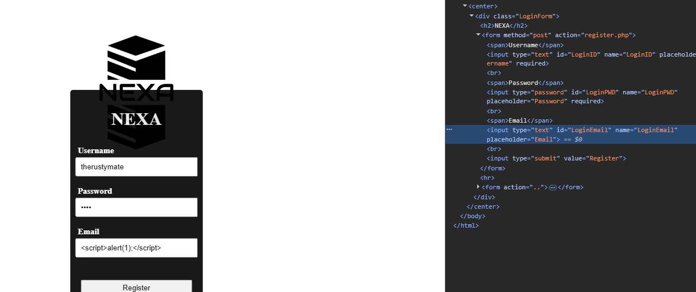

# NEXA Website Overview
The NEXA website was an online store developed by a for-profit organization targeting NEXA business customers, offering internet-related products and generating revenue. It is currently shut down.

Built by @rajashua (@therustymate) at 2024-04-21

Before starting the hacking process, we will first set up the victim server.<br>
Using **phpMyAdmin**, we created a database named `targetdb` and an internal table called `users`.<br>
The columns are: `id`, `pwd`, `salt`, and `email`. Below is the PHP server configuration information.<br>

```php
$servername = "localhost:3306";
$username = "root";
$password = "";
$dbname = "targetdb";
```

## Register Page


It has been confirmed that fields other than the email are being filtered.


Currently, the account registration page uses an `<input type="email" ... >` field for the email. This is a very basic form of filtering, which can be easily bypassed by tampering with the input type on the client side. We will investigate whether the server has any additional filtering mechanisms for the email field.

After changing the input field to `<input type="text" ... >`, we were able to successfully input other types of data. Currently, we have entered the value test into the email field.

## Administration Page


Upon checking the admin page, we confirmed that the value `test` was immediately recorded. This suggests that there are no additional filtering mechanisms in place on the server side.

Now, we will attempt to perform a Cross-Site Scripting (XSS) attack using the email field. The type of attack we are conducting is a **stored XSS attack**.

## Exploitation


We submitted the following JavaScript code in the email field. The expected behavior is that the browser will display a message box showing the number `1`:
```js
script>alert(1);</script>
```


When the administrator accesses the <ins>compromised admin page</ins>, we confirmed that the JavaScript is executed. With additional scripting, it's possible to steal the administrator’s cookie information or perform other actions, potentially leading to **full control over the administrator’s account**.

---

In conclusion, the NEXA business website, which was developed on 2024-04-21, and operated for a certain period in the past, was found to be <ins>vulnerable to XSS attacks</ins>. If an attacker had targeted this website, it is likely that they could have not only <ins>gained control over the administrator account but also accessed some client account information</ins>. Therefore, the NEXA website has been confirmed to be **vulnerable**.